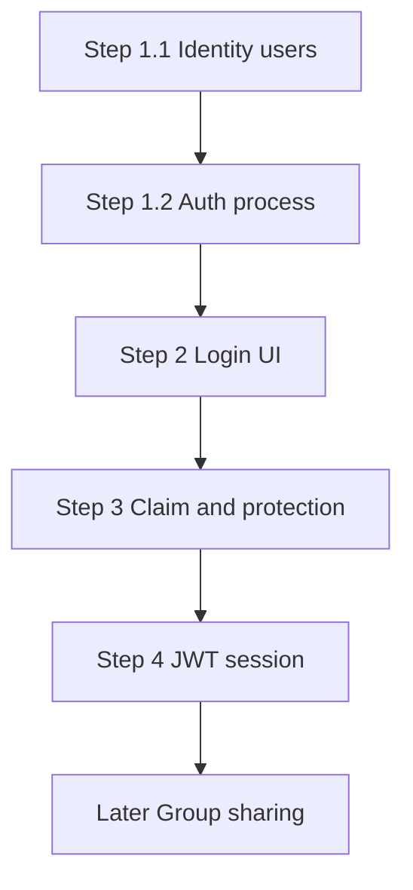

# Users with ASP.NET Identity

Add users with ASP.NET Identity in four steps: first the backend, then login and registration in the frontend, then assignment of existing data and protection of the APIs, and finally the JWT session. The backend step is two pull requests. Pockets and rules belong to the user. Sharing is not part of this work: later it will be a group of users that shares selected pockets and selected rules.

Four steps, in this order. The first one is split into 1.1 and 1.2, one pull request each. The last one is split into 4.1, 4.2, and 4.3. After approval, only step 1.1 is implemented. The following steps start when you ask for them.

Sharing is out of this work. The schema only leaves room for it later, without moving pockets, rules, or transactions.

Category rules belong to the user, the same way pockets do. A rule does not follow the pocket: it belongs to the person who created it. Transactions stay tied only to the pocket: access goes through the pocket, not through a user column on the transaction.

Future sharing is a group. A user picks the other users to create it with. The group shares the selected pockets and the selected rules, not every pocket and not every rule owned by the members. It is not a `PocketShare` row per user, and it is not an Identity role.

## Model that should not be redone later

- `ApplicationUser` extends `IdentityUser` (string id, login with `UserName` and password). No application roles.
- On [backend/KeepItSimple.Api/models/Pocket.cs](backend/KeepItSimple.Api/models/Pocket.cs), nullable `OwnerId` pointing at the user. That user is the owner.
- On [backend/KeepItSimple.Api/models/CategoryRule.cs](backend/KeepItSimple.Api/models/CategoryRule.cs), nullable `UserId` pointing at the user. That user is the owner of the rule. The step 3 claim also assigns rules that still have no user, and from then on creating, reading, and updating rules uses only that user's rules.
- [backend/KeepItSimple.Api/models/Transaction.cs](backend/KeepItSimple.Api/models/Transaction.cs) does not get a user. Reads and writes stay valid when the pocket is accessible.
- `OwnerId` and `UserId` use `[JsonIgnore]`, so current responses keep the same shape. Deleting a user uses `Restrict`, so pockets and rules are not deleted with the user.
- One access filter, in a helper, used by pockets, rules, and transactions. Today it is the owner. Later the same filter adds the group, without rewriting each query:
  - a pocket is visible when `OwnerId == me` or the pocket is among those selected in a group the user belongs to
  - a rule is visible when `UserId == me` or the rule is among those selected in a group the user belongs to
  - a transaction is visible when its pocket is visible
- Group tables are not created now. When they are needed, they are additive: `Group`, members (`GroupId`, `UserId`), selected pockets (`GroupId`, `PocketId`), selected rules (`GroupId`, `CategoryRuleId`). The owner stays on the pocket and on the rule.

## Data already in the database

No drop and no seed user. The migration is additive only: Identity tables, nullable `Pockets.OwnerId` and `CategoryRules.UserId`, foreign keys, and indexes. Pockets, transactions, and rules stay as they are, with a null owner.

Assignment is the step 3 claim: the signed-in user takes the rows that still have no owner. Do this before creating a second account, otherwise that claim only takes whatever is still null. Columns stay nullable in the database, so `database update` does not reject the old rows. After the claim, the application requires an owner.

## Step 1 — Backend, without requiring login

Two pull requests. Domain APIs stay open in both.

### Step 1.1 — Identity users, login and logout

- Package `Microsoft.AspNetCore.Identity.EntityFrameworkCore` aligned with EF Core 10.
- `ApplicationUser` extends `IdentityUser`. [backend/KeepItSimple.Api/helpers/KeepItSimpleDbContext.cs](backend/KeepItSimple.Api/helpers/KeepItSimpleDbContext.cs) becomes `IdentityDbContext<ApplicationUser>`. `OnModelCreating` still calls `base` and adds the `OwnerId` and `UserId` foreign keys.
- In [backend/KeepItSimple.Api/Program.cs](backend/KeepItSimple.Api/Program.cs): `AddIdentityCore<ApplicationUser>` (email not required, no email confirmation), EF store, `SignInManager`. Passwords use Identity's default rules.
- `AccountController` at `/api/account`:
  - `POST register` — username, password, password confirmation. Duplicate username or rejected password: 400.
  - `POST login` — `PasswordSignInAsync`.
  - `POST logout`
  - `GET me` — id and username, or 401.
- DTOs in `dtos/Account/`. The controller does not open the `DbContext`: it uses `UserManager` and `SignInManager`.
- A new migration for the Identity tables and the nullable owner columns. Migrations already in the tree are left unchanged. Creates do not write `OwnerId` / `UserId`.
- A note in [backend/docs/Accounts.md](backend/docs/Accounts.md) for the user schema and the account endpoints, plus an Account row in [backend/README.md](backend/README.md).

### Step 1.2 — Auth process

- Identity cookie on the application scheme: `HttpOnly`, `SameSite=Lax` (localhost:3000 and localhost:5264 are same-site), `Secure` only when the request is already HTTPS.
- An unauthenticated call to a protected endpoint returns 401. A forbidden call returns 403. The API does not redirect to an HTML login page.
- [backend/KeepItSimple.Api/Program.cs](backend/KeepItSimple.Api/Program.cs) runs `UseAuthentication` and `UseAuthorization` before the controllers.
- Login from step 1.1 is what establishes that cookie. Logout clears it. `GET me` reads the signed-in user from it. Step 4 replaces this cookie with the JWT; until then the cookie is the session.
- No `[Authorize]` yet on pockets, transactions, rules, analytics, or test data. No credentialed CORS yet: login can be checked from Swagger on the same origin.
- Extend [backend/docs/Accounts.md](backend/docs/Accounts.md) with the cookie session: what login sets, what logout clears, and why domain APIs stay open until step 3.

## Step 2 — Login screen, APIs still open

- Development CORS: origin `http://localhost:3000`, `AllowCredentials`. `AllowAnyOrigin` is removed, because it cannot be used with cookies.
- [frontend/lib/fetchWrapper.ts](frontend/lib/fetchWrapper.ts): `credentials: "include"` on every request.
- `/login` and `/register` pages (username and password), outside the sidebar shell.
- [frontend/components/sidebar/NavUser.tsx](frontend/components/sidebar/NavUser.tsx) reads `GET /api/account/me` instead of the hardcoded user and calls logout.
- The app stays usable without a session. Update [frontend/README.md](frontend/README.md) and, if needed, the root README.

## Step 3 — Claim and protection

- `POST /api/account/claim-unowned`, authenticated only: assigns to the caller the pockets with a null `OwnerId` and the rules with a null `UserId`.
- `[Authorize]` on every controller except register and login. `TestDataController` stays Development-only, and still requires the user.
- Controllers pass the user id into the model methods. The filter is the one described above: today the owner only, pockets with `OwnerId == userId` and rules with `UserId == userId`. Transactions, analytics, import, and transfer go through the accessible pocket; someone else's pockets or rules return 404. The group is not queried yet.
- Creating a pocket or a rule writes the owner. A 401, including from the `NavUser` placeholder, sends the user to `/login`.
- Update the note in `backend/docs/Accounts.md`.

## Step 4 — JWT session

The cookie from step 1.2 carries the signed-in user until this step. Here the session is two tokens. The access token is a short-lived JWT sent as a bearer. The refresh token is a long-lived opaque value in an HttpOnly cookie, rotated on each use. Identity's default token providers stay: they issue the one-time values for password reset, email confirmation, and authenticator codes. They are not the refresh token.

An idle user is signed out after 14 days. An active user stays signed in, because each refresh starts a new 14-day lifetime. The access token itself expires after 15 minutes and is not sliding.

Three substeps, in this order.

### Step 4.1 — Configure JWT

- Package `Microsoft.AspNetCore.Authentication.JwtBearer` aligned with EF Core 10 (`10.0.12`). It is not part of the shared framework.
- Configuration section `Jwt`: `Issuer`, `Audience`, `Key`, access lifetime 15 minutes, refresh lifetime 14 days. The key is at least 32 characters and lives in user secrets or an environment variable, not in the committed `appsettings.json`.
- In [backend/KeepItSimple.Api/Program.cs](backend/KeepItSimple.Api/Program.cs), after Identity: `AddAuthentication` with `JwtBearer` as the default authenticate and challenge scheme. Validation checks issuer, audience, lifetime, and the signing key (`HMAC-SHA256`). `AddAuthorization` is registered. `UseAuthentication` and `UseAuthorization` stay before the controllers.
- Access token claims are the user id (`ClaimTypes.NameIdentifier`) and the username (`ClaimTypes.Name`). Issuer, audience, and key match the validation parameters. A helper builds the token. The controller does not sign it inline.
- Refresh token: 32 random bytes, stored only as a SHA-256 hash. Entity `RefreshToken` (user id, hash, expires, created, revoked, replaced-by). One row per login. Deleting a user cascades these rows. A new migration adds the table. Migrations already in the tree are left unchanged.
- Cookie `kis_refresh`: `HttpOnly`, `SameSite=Lax` (localhost:3000 and localhost:5264 are same-site), `Secure` only when the request is already HTTPS, `Path=/api/account`. The browser stores it. Script cannot read it.
- `POST login` checks the password, returns `{ accessToken, expiresAt }`, and sets the refresh cookie.
- `POST refresh` reads that cookie. A valid row is revoked, a new row and a new cookie are issued, and the response is a new access token. Each rotation gets a fresh 14-day expiry. A missing, expired, or revoked cookie is 401. Presenting a token that was already rotated revokes every active refresh token of that user and clears the cookie.
- `POST logout` revokes the refresh row for that cookie and clears the cookie. It is idempotent. `GET me` reads id and username from the bearer token, or returns 401.
- Extend [backend/docs/Accounts.md](backend/docs/Accounts.md): access token, refresh cookie, rotation, reuse, and logout.

### Step 4.2 — UI sends the bearer

- The access token stays in memory. A reload starts with no access token and calls `POST /api/account/refresh` once. Logout drops the memory value and calls `POST /api/account/logout`.
- [frontend/lib/fetchWrapper.ts](frontend/lib/fetchWrapper.ts) keeps `credentials: "include"` and sends `Authorization: Bearer <token>` on every request, including `FormData` uploads.
- A 401 from any call except login and refresh calls `POST /api/account/refresh` once, stores the new access token, and retries the original request once. A failed refresh sends the user to `/login`.
- Development CORS still allows origin `http://localhost:3000`, credentials, and the `Authorization` header.
- [frontend/components/sidebar/NavUser.tsx](frontend/components/sidebar/NavUser.tsx) still uses `GET /api/account/me` and logout.

### Step 4.3 — Endpoints use them

- `[Authorize]` from step 3 succeeds when the access token is valid. The refresh cookie does not authenticate those calls.
- Controllers read the caller id from `ClaimTypes.NameIdentifier` and pass it into the model methods. The access filter is unchanged: pockets with `OwnerId == userId`, rules with `UserId == userId`, transactions through the accessible pocket.
- Register, login, and refresh stay anonymous. Logout uses the refresh cookie. Every other controller, including `TestDataController` in Development, requires the access token.
- Swagger sends the bearer token. The refresh cookie is exercised from the UI. Update the note in `backend/docs/Accounts.md`.
