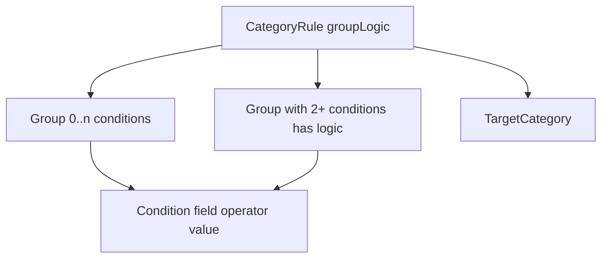
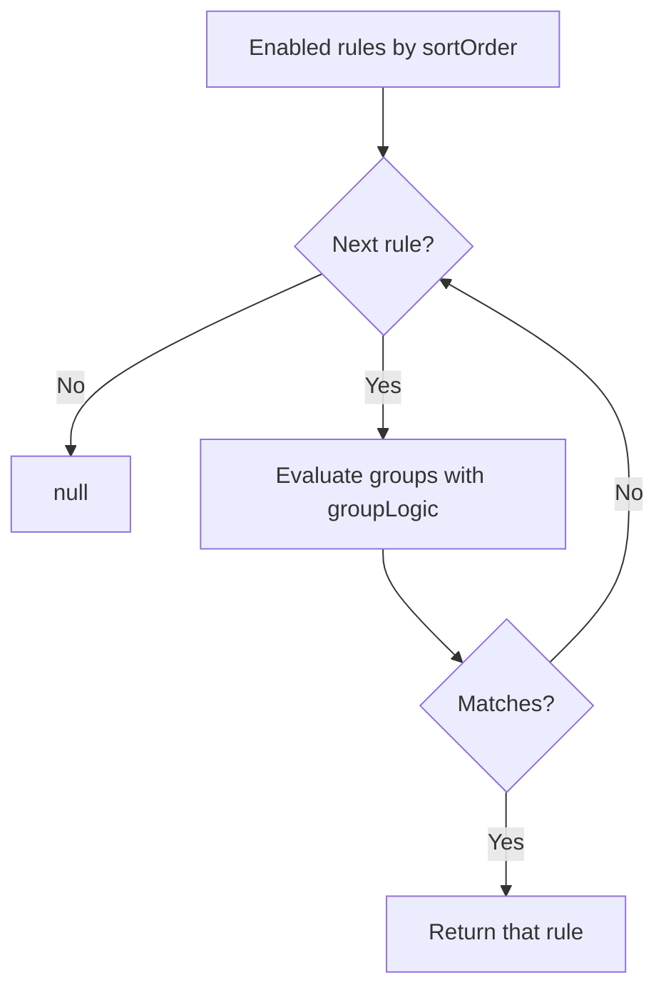

# CategoryRuleMatcher

Implementation reference for [`helpers/CategoryRuleMatcher.cs`](./helpers/CategoryRuleMatcher.cs).

**Controller:** [`controllers/CategoryRuleController.cs`](./controllers/CategoryRuleController.cs) (`/api/category-rules`)  
**Model:** [`models/CategoryRule.cs`](./models/CategoryRule.cs)  
**Product flow (UI conversation):** [CategoryRules.md](./CategoryRules.md)  
**Backend overview:** [../README.md](../README.md)

---

## Purpose

Evaluate user-defined categorization rules against a **transaction snapshot** (`description`, `amount`, **already resolved** `category`, `pocketId`). The matcher is a pure helper: no I/O. Callers load enabled rules ordered by `SortOrder` and pass them in.

Used from:

- `TransactionImporter.Preview` — after `TryParseCategory` (enum + Italian aliases)
- `CategoryRule.PreviewApplyAsync` / `ApplyAsync` — saved rows, category only

First matching **enabled** rule wins. Evaluation never chains: the snapshot is the original description / amount / category / pocket, not a previous rule’s output.

If a rule has no `Category` condition, it only matches when the snapshot category is `Other`. A category condition in the formula opts in to already-categorized rows.

---

## Public surface

| Method | Role |
|--------|------|
| `FindMatch(description, amount, category, rules, pocketId = 0)` | First matching rule, or `null` |
| `IsOperatorAllowed(field, operator)` | Operator whitelist per field (used by validation) |

`CategoryRule` CRUD / reorder / apply live on the model (same Active Record style as `Pocket`).

---

## Rule tree



- `groupLogic`: `And` or `Or` between groups. One operator for the whole rule, so mixed infix `A AND B OR C` cannot appear at this level.
- Group with **one** condition: evaluate that condition; `logic` is ignored (and stripped on save).
- Group with **2+** conditions: `logic` `And` (all) or `Or` (any). Required.
- Empty groups / empty condition lists do not match.

Persisted as jsonb on `CategoryRules.Groups`. Shared serializer: [`helpers/CategoryRuleJson.cs`](./helpers/CategoryRuleJson.cs) (camelCase properties, string enums, omit null `logic`).

---

## Matching in detail



1. Skip `Enabled == false`.
2. Combine group results with `groupLogic` (`And` → all groups, `Or` → any group).
3. A group with one condition is that condition. A group with many conditions uses its `logic`.
4. Return the rule (caller reads `TargetCategory`). Later rules are not applied to this snapshot.

### Conditions

| Field | Operators | Notes |
|-------|-----------|--------|
| `Description` | `Contains`, `Equals` | Trim, case-insensitive. `Contains` matches a whole word (so `ENI` does not match `Enoteca`). Null/blank description never matches |
| `Amount` | `Gt`, `Gte`, `Lt`, `Lte`, `Eq` | Invariant decimal. Signed: expenses are negative |
| `Category` | `Equals`, `NotEquals` | Parsed as `TransactionCategory`. This is the category **before** the rule override. If the rule has **no** category condition, it only matches `Other` |
| `Pocket` | `Equals`, `NotEquals` | Value is the pocket id as a decimal-free integer string. Import uses the session pocket |

Invalid operator/field pairs fail validation on save and do not match at runtime.

---

## Import wiring

`TransactionImporter.Preview(request, rules)` is still synchronous. The controller loads rules then passes them in:

```
POST /import/preview
  → CategoryRule.GetEnabledOrderedAsync()
  → TransactionImporter.Preview(request, rules)
  → BuildTransaction → TryParseCategory → CategoryRuleMatcher.FindMatch
```

Tests can call `Preview` without rules (default empty list): existing import tests stay DB-free.

---

## HTTP (service)

Base route: `/api/category-rules`

Create/update run `Normalize()` then `Validate()`:

- Name required
- At least one group, each with at least one condition
- `logic` required when a group has 2+ conditions
- Amount values must parse; category values must be a known enum; pocket values must be a positive integer id

`PUT /reorder` assigns `SortOrder` `0..n-1` from the id list (top of the UI list is `0`).

`POST /preview-apply` filters by optional `pocketId`, `from`, and `to` (same day bounds as the transaction list), then re-evaluates at call time. `POST /apply` takes the previewed ids and skips a row if the match is missing or the target is already the current category.

---

## Tests

`KeepItSimple.Api.Tests/categoryRules/CategoryRuleMatcherTests.cs` — no database.

Covers AND groups, `groupLogic: And` with an inner OR group (`Amount > 0 AND (equals OR contains)`), OR between groups, first-match `sortOrder`, disabled rules, case-insensitive description, existing category, implicit `Other` unless a category condition is present, pocket equals/not equals, blank description.

Import: `Preview_applies_the_first_matching_category_rule` in `transactionImport/PreviewTests.cs`.
