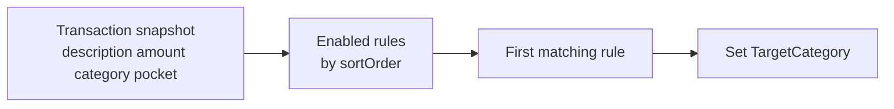
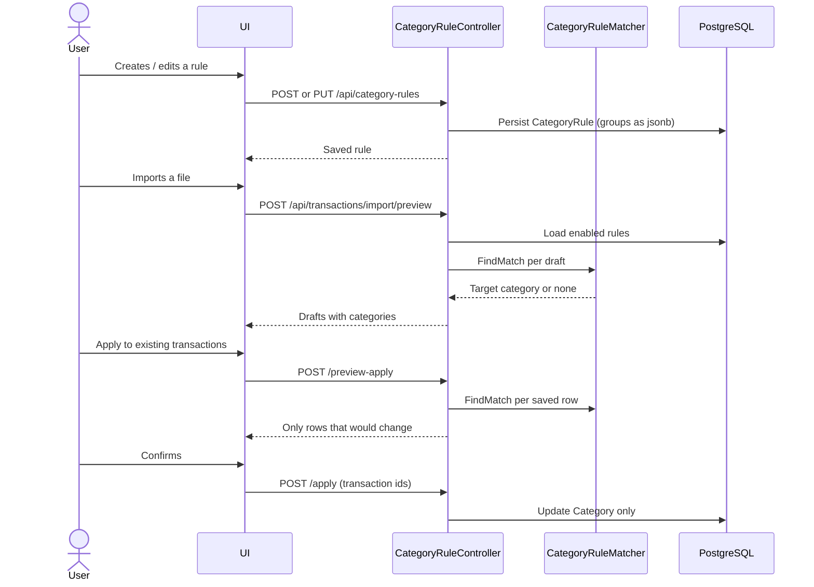

# CategoryRules

End-to-end conversation between UI and API: **define groups → match transactions → set category**.

**Matcher details:** [CategoryRuleMatcher.md](./CategoryRuleMatcher.md)  
**Import flow (rules run at preview):** [TransactionImportFlow.md](./TransactionImportFlow.md)  
**Backend overview:** [../README.md](../README.md)

---

## Big picture

Users configure simple categorization rules. No expression language. **Groups replace parentheses.**

- Each group is a parenthesized set of conditions.
- Inside a group, AND or OR is chosen only when there are **two or more** conditions. A single condition has no inner operator.
- Between groups, one `groupLogic` (`And` or `Or`) applies to the whole rule.

The action of a matching rule is always: **set `TargetCategory`**.



---

## Sequence (UI ↔ API)



---

## Step by step

### 1. Define a rule

UI: `/transactions/rules`. Drawer builder, not a textarea.

| Piece | Meaning |
|-------|---------|
| Name | Label in the list and in apply-preview |
| Enabled | Disabled rules are skipped |
| Sort order | List position. Top rule is tried first; first match wins |
| Target category | Category to assign when the rule matches |
| `groupLogic` | AND or OR **between groups** |
| Groups | Parentheses. Inner `logic` only if the group has 2+ conditions. Fields: description, amount, category, pocket |

Example: `Amount > 0 AND [description equals "stringa" OR description contains "stringa"]`. Pocket conditions compare the transaction pocket id (`Equals` / `NotEquals`).

```json
{
  "name": "Income with description match",
  "enabled": true,
  "sortOrder": 0,
  "targetCategory": "Salary",
  "groupLogic": "And",
  "groups": [
    {
      "conditions": [
        { "field": "Amount", "operator": "Gt", "value": "0" }
      ]
    },
    {
      "logic": "Or",
      "conditions": [
        { "field": "Description", "operator": "Equals", "value": "stringa" },
        { "field": "Description", "operator": "Contains", "value": "stringa" }
      ]
    }
  ]
}
```

The first group has one condition, so it has no `logic`. Combining it with the second group uses `groupLogic: And`.

### 2. Import preview

After the file column is parsed (enum name or Italian alias), enabled rules run on the draft. The user can still change the category in the preview table before confirm.

Details: [TransactionImportUtil.md](./TransactionImportUtil.md) step 2.

### 3. Apply to existing transactions

Explicit two-step action from the Rules page. Never automatic on create/update of a transaction.

1. `POST /api/category-rules/preview-apply` with optional `pocketId`, `from`, `to` → only rows in that pocket/date range whose category **would change**.
2. `POST /api/category-rules/apply` with those `transactionIds` → updates `Category` only (pocket balance unchanged).

There is no “manually edited” flag. Rules **without** a category condition only match `Other`, so they do not overwrite Food/Shopping/etc. To recategorize those rows, add a category condition to the formula. Preview-apply still lists only rows whose category would change.

---

## Endpoints cheat sheet

| Action | Method | Path | Body |
|--------|--------|------|------|
| List | `GET` | `/api/category-rules` | — |
| Get | `GET` | `/api/category-rules/{id}` | — |
| Create | `POST` | `/api/category-rules` | JSON rule (no id) |
| Update | `PUT` | `/api/category-rules/{id}` | JSON rule |
| Delete | `DELETE` | `/api/category-rules/{id}` | — |
| Reorder | `PUT` | `/api/category-rules/reorder` | `{ "ids": [3,1,2] }` |
| Preview apply | `POST` | `/api/category-rules/preview-apply` | `{ "pocketId": 1, "from": "2026-06-21", "to": "2026-09-21" }` all optional |
| Apply | `POST` | `/api/category-rules/apply` | `{ "transactionIds": [1,2] }` |

Enums in JSON are strings (`"And"`, `"Gt"`, `"Shopping"`).

---

## Out of scope (v2)

- Nested groups (`A AND (B OR (C AND D))`)
- Expression language / parentheses in a string
- `NOT`, regex, starts-with
- Auto-run on transaction create/update
- Flag to skip rows the user categorized by hand
- Replacing `CategoryAliases` in the importer
