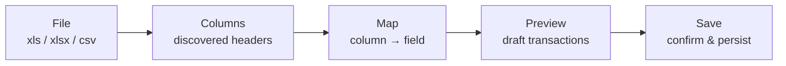
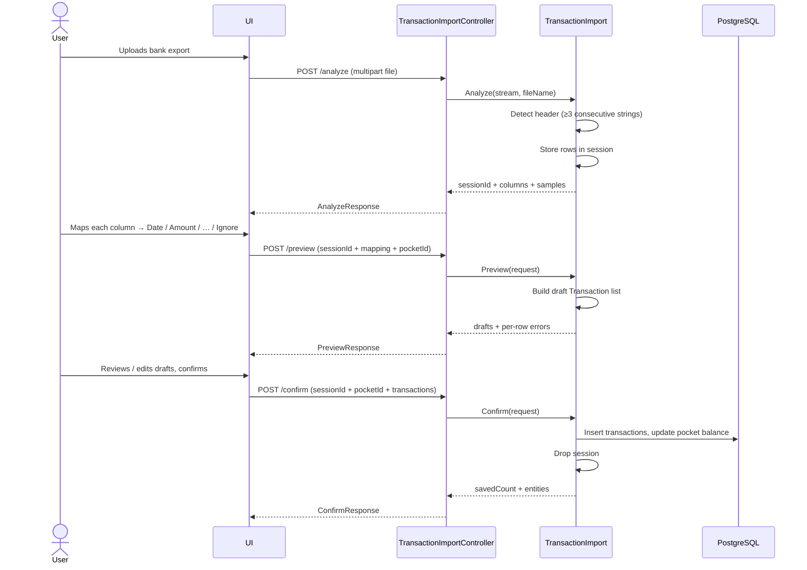
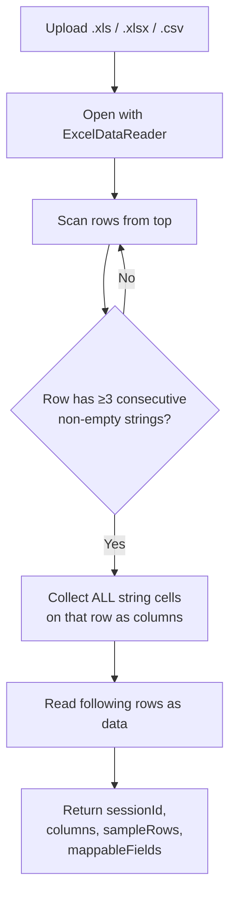
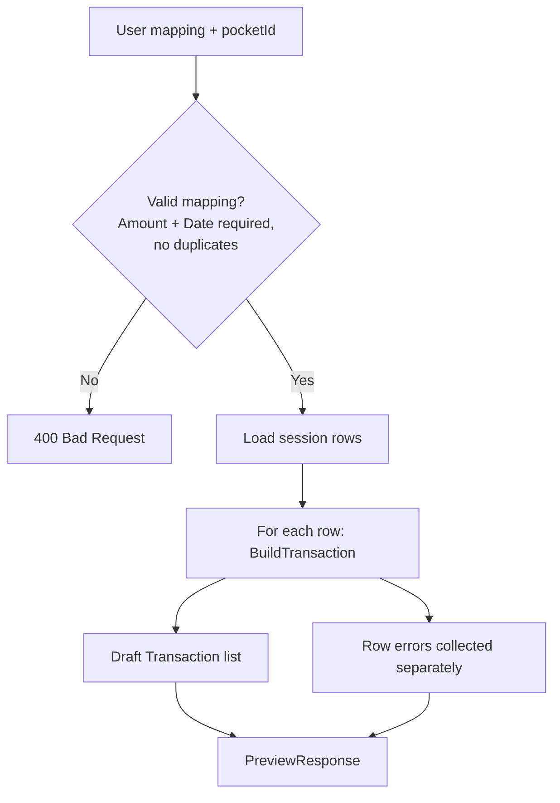
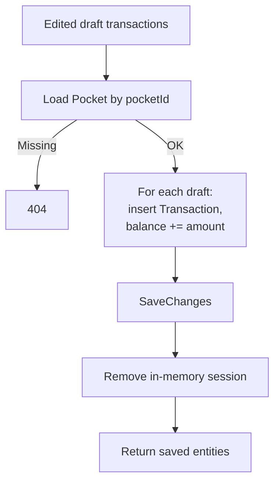
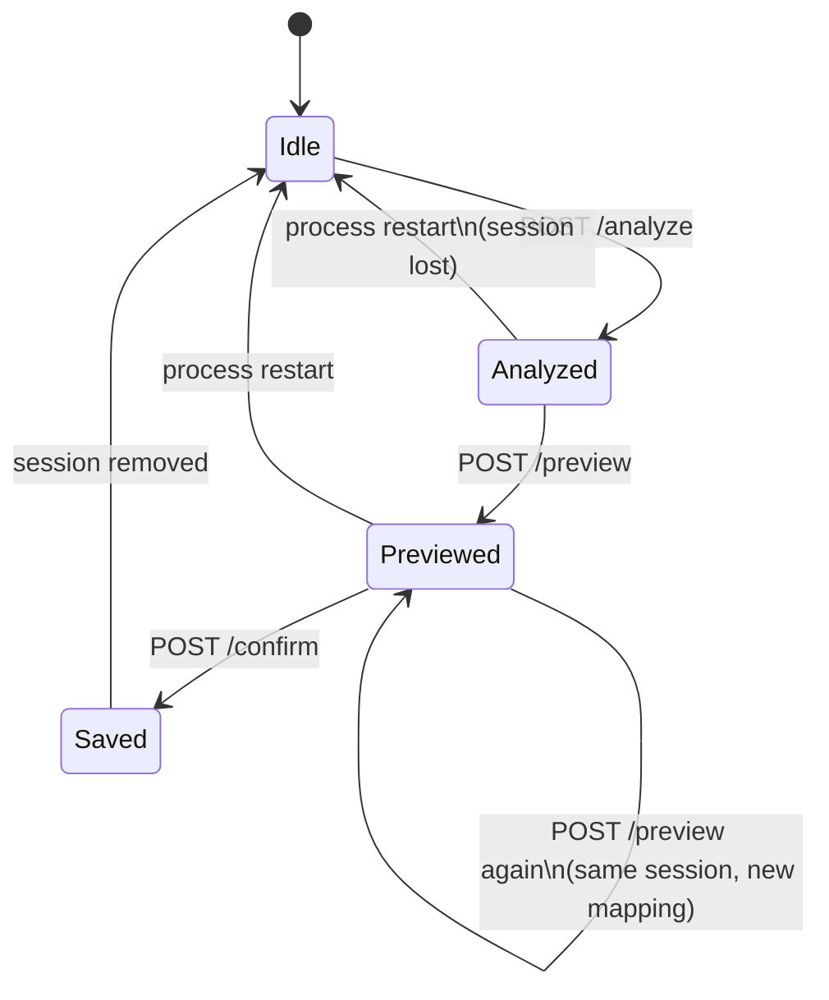

# TransactionImportFlow

End-to-end conversation between UI and API: **file → columns → map → save**.

**Helper details:** [TransactionImportUtil.md](./TransactionImportUtil.md)  
**Backend overview:** [../README.md](../README.md)

---

## Big picture

The user never dumps raw Excel into the database. Each step is an explicit API round-trip so the UI can show progress, let the user choose mappings, and review drafts before write.

---

## Sequence (UI ↔ API)

---

## Step by step

### 1. File → columns (`analyze`)

**UI responsibility:** render each discovered column and let the user pick a target field (`Ignore`, `Description`, `Amount`, `Date`, `Category`). Sample rows help disambiguate labels like `"Data di erogazione"`.

| Excel column | User maps to |
|--------------|--------------|
| Data di erogazione | `Date` |
| Causale | `Description` |
| Importo | `Amount` |
| Valuta | `Ignore` |

---

### 2. Columns → map → drafts (`preview`)

**UI responsibility:** show the draft table, surface row errors, allow edits (amount sign, category, drop a line) before confirm.

Nothing is written to the database yet.

---

### 3. Map → save (`confirm`)

**UI responsibility:** call confirm only after explicit user confirmation; then refresh the transaction list / pocket balance from the normal CRUD APIs.

---

## State machine

---

## Endpoints cheat sheet

| Step | Method | Path | Body |
|------|--------|------|------|
| File → columns | `POST` | `/api/transactions/import/analyze` | `multipart`: `file` |
| Columns → map | `POST` | `/api/transactions/import/preview` | JSON: `sessionId`, `pocketId`, `mapping`, `defaultCategory?` |
| Map → save | `POST` | `/api/transactions/import/confirm` | JSON: `sessionId`, `pocketId`, `transactions` |

---

## Minimal happy path

1. User uploads `estratto.xlsx`
2. API returns columns `Data`, `Descrizione`, `Importo`, `Saldo`
3. User maps Data→`Date`, Descrizione→`Description`, Importo→`Amount`, Saldo→`Ignore`
4. API returns N draft transactions (and maybe a few row errors)
5. User confirms → N rows in `Transactions`, pocket balance updated
