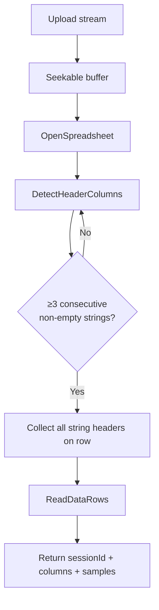
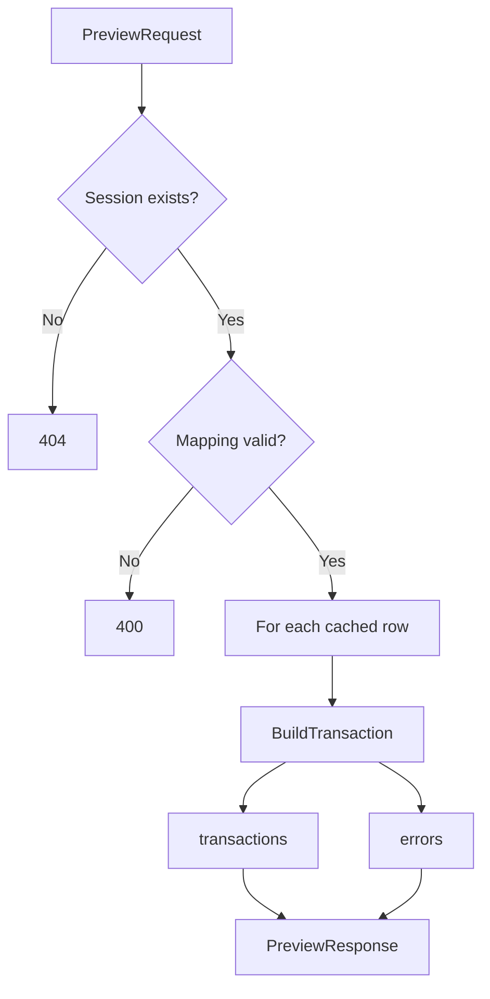
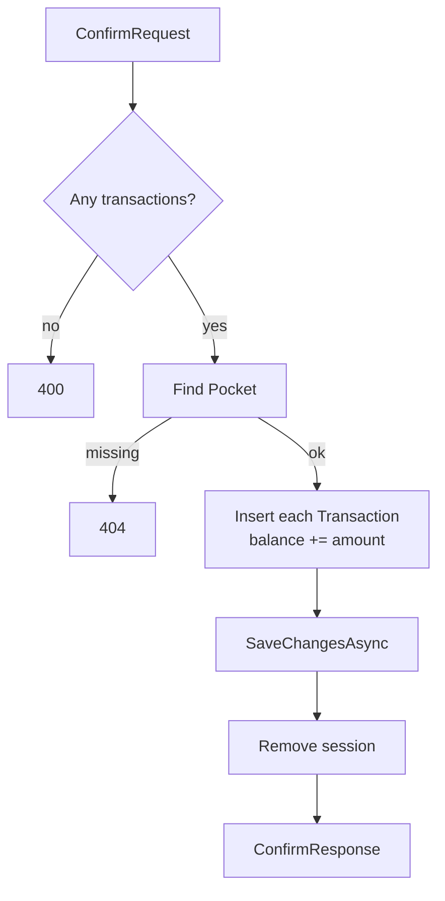

# TransactionImportUtil

Implementation reference for [`helpers/TransactionImporter.cs`](./helpers/TransactionImporter.cs).

**Controller:** [`controllers/TransactionController.cs`](./controllers/TransactionController.cs) (`POST /api/transactions/import/...`)  
**DTOs:** [`dtos/Transaction/`](./dtos/Transaction/)  
**Product flow (UI conversation):** [TransactionImportFlow.md](./TransactionImportFlow.md)  
**Backend overview:** [../README.md](../README.md)

---

## Purpose

Imports bank/export files whose layout is **unknown in advance**. The UI never assumes fixed column names: the API discovers headers, the user maps them onto `Transaction` fields (`MappableField`), drafts are previewed, then saved.

Supported formats: `.xls`, `.xlsx`, `.xlsm`, `.csv`. ExcelDataReader opens workbooks from the file bytes; if that fails, it falls back to the CSV reader.

Logic lives in `TransactionImporter` (static methods). Request/response types live in `dtos/Transaction/`. Nested types that are also part of the payload (`ExcelColumn`, `ColumnMapping`, `MappableField`) stay on the importer. `TransactionController` only validates HTTP input and maps exceptions to status codes.

Sessions live in a process-local `ConcurrentDictionary` (lost on restart / not shared across instances).

---

## Public surface

| Method                      | Role                                                                  |
| --------------------------- | --------------------------------------------------------------------- |
| `Analyze(Stream)`           | Open file, find header row, cache data rows, return columns + samples |
| `Preview(PreviewRequest)`   | Apply user column mapping → draft `Transaction` list                  |
| `Confirm(ConfirmRequest)`   | Persist drafts, update pocket balance, drop session                   |

Mappable target fields (`MappableField`):

- `Ignore` – skip column
- `Description`
- `Amount` (**required** in mapping)
- `Date` (**required** in mapping)
- `Category` – optional; enum name or Italian alias (see below)

`PocketId` is never taken from the file: the UI supplies it on preview/confirm.

---

## Step 1 – `Analyze` in detail

1. Registers code-page encodings once (needed for legacy `.xls`).
2. Copies the upload into a seekable `MemoryStream` (ExcelDataReader requirement).
3. Opens the file with `OpenSpreadsheet` (Excel workbook, or CSV if that fails).
4. **`DetectHeaderColumns`** (not “first row”):
   - Scans rows from the top.
   - A row is a header when it contains **at least 3 consecutive cells** whose value is a **non-empty `string`** (numbers/dates do not count).
   - Rationale: a real statement header always includes at least date, description/causale, amount.
   - On that row, **every** non-empty string cell becomes an `ExcelColumn` (`Index` 1-based, `Name` = cell text). Empty cells are skipped.
5. **`ReadDataRows`**: all following non-empty rows are stored in the session as `Dictionary<columnIndex, string>`. Up to **10** sample rows (keyed by column name) go back to the UI.
6. Returns `AnalyzeResponse`:
   - `sessionId` – opaque handle for preview/confirm
   - `columns` – discovered headers
   - `sampleRows` – first 10 data rows



If no header row is found → `InvalidOperationException` → HTTP 400.

---

## Step 2 – `Preview` in detail

1. Loads the in-memory session by `sessionId` (missing → 404).
2. `ValidateMapping`:
   - at least one column mapped to `Amount`
   - at least one column mapped to `Date`
   - no duplicate non-`Ignore` targets
3. For each cached data row, `BuildTransaction`:
   - walks the mapping; `Ignore` skipped
   - `ParseAmount` – strips `€`/spaces; handles `1.234,56` and `1,234.56`
   - `ParseDate` – common EU/US formats, `it-IT` (month names, dotted dates), invariant, Excel OA date serial
   - `Category` – `Transaction.TransactionCategory` enum name (case-insensitive), else Italian aliases after accent stripping (`stipendio` → `Salary`), else `defaultCategory` (default `Other`)
4. Successful rows → `transactions`; failures → `errors` like `"Row N: …"` (drafts are still returned). `N` is 1-based from the header row (header = 1).

Nothing is written to the DB here. The UI may edit drafts before confirm.



---

## Step 3 – `Confirm` in detail

1. Rejects an empty `transactions` list (HTTP 400).
2. Resolves `Pocket` by `pocketId` (missing → 404).
3. For each draft in the request body:
   - clears `Id` (callers cannot overwrite existing rows)
   - sets `PocketId` / navigation from the request (not from the draft)
   - `pocket.Balance += amount`
   - `Add` to `Transactions`
4. Single `SaveChangesAsync`.
5. Removes the import session from memory.
6. Returns `savedCount` + persisted entities.

Balance semantics match the rest of the app: negative amount = expense, positive = income.



---

## HTTP endpoints

Base route: `/api/transactions/import`

| Step | Method | Path       | Input                                          |
| ---- | ------ | ---------- | ---------------------------------------------- |
| 1    | `POST` | `/analyze` | `multipart/form-data` field `file` (max 10 MB) |
| 2    | `POST` | `/preview` | JSON `PreviewRequest`                          |
| 3    | `POST` | `/confirm` | JSON `ConfirmRequest`                          |

### Example – analyze response

```json
{
  "sessionId": "3fa85f64-5717-4562-b3fc-2c963f66afa6",
  "columns": [
    { "index": 1, "name": "Data di erogazione" },
    { "index": 2, "name": "Causale" },
    { "index": 3, "name": "Importo" },
    { "index": 4, "name": "Valuta" }
  ],
  "sampleRows": [
    {
      "Data di erogazione": "01/03/2026",
      "Causale": "Stipendio",
      "Importo": "2500.00",
      "Valuta": "EUR"
    }
  ]
}
```

### Example – preview request

```json
{
  "sessionId": "3fa85f64-5717-4562-b3fc-2c963f66afa6",
  "pocketId": 1,
  "defaultCategory": "Other",
  "mapping": [
    { "columnIndex": 1, "targetField": "Date" },
    { "columnIndex": 2, "targetField": "Description" },
    { "columnIndex": 3, "targetField": "Amount" },
    { "columnIndex": 4, "targetField": "Ignore" }
  ]
}
```

### Example – confirm request

```json
{
  "sessionId": "3fa85f64-5717-4562-b3fc-2c963f66afa6",
  "pocketId": 1,
  "transactions": [
    {
      "description": "Stipendio",
      "amount": 2500.0,
      "date": "2026-03-01T00:00:00Z",
      "category": "Salary",
      "pocketId": 1
    }
  ]
}
```

---

## Current limits

- Sessions are **in-memory only** (not shared across instances; cleared on restart).
- Only the **first sheet** is read.
- Header detection requires true `string` cells for the 3-consecutive rule (Excel numeric cells do not qualify).
- No duplicate-transaction detection / idempotency.
- No auth on the import endpoints yet.
