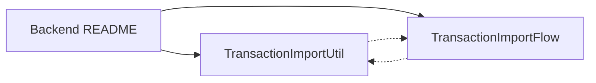

# KeepItSimple – Backend

ASP.NET Core Web API (`net10`) that powers KeepItSimple: pockets, transactions, analytics, and file-based transaction import.

## Stack

- **ASP.NET Core** + controllers
- **EF Core** + **PostgreSQL** (Npgsql)
- **Swagger** in Development
- **Docker Compose** at repo root for Postgres

## Layout

```
backend/
├── README.md                 ← this file
├── KeepItSimple.Api/
│   ├── controllers/          ← HTTP endpoints
│   ├── dtos/Transaction/     ← import request / response types
│   ├── helpers/              ← TransactionImporter, DB access, currency
│   ├── models/               ← domain entities (Active Record style)
│   ├── Migrations/
│   └── Program.cs
└── Tests/
    └── KeepItSimple.Api.Tests/
```

## Domains

| Area | Routes | Notes |
|------|--------|--------|
| Pockets | `/api/pocket` | Accounts with balance / currency |
| Transactions | `/api/transactions` | CRUD, filter by pocket, and file import |
| Analytics | `/api/analytics`, `/api/analytics/{kind}` | Dashboard totals and period insights (income, spending, savings, investments, interest) |

Persistence goes through `KeepItSimpleDbContext`; app code typically uses the static `KeepItSimpleContext` helper to open a scoped DbContext.

## Transaction import

Bank/export files (`.xls` / `.xlsx` / `.xlsm` / `.csv`) have **unknown layouts**. The API discovers columns, the user maps them onto `MappableField` values, drafts are previewed, then saved.

Docs inside the API project:

- **[TransactionImportUtil.md](./KeepItSimple.Api/TransactionImportUtil.md)** – how `TransactionImporter` works (analyze / preview / confirm)
- **[TransactionImportFlow.md](./KeepItSimple.Api/TransactionImportFlow.md)** – UI ↔ API conversation: file → columns → map → save



## Tests

`dotnet test KeepItSimple.sln` from the repo root.

`KeepItSimple.Api.Tests` covers `TransactionImporter.Analyze` and `Preview`, which are pure and need no database.

Excel/CSV fixtures are **not committed**. `ExcelFixtureGenerator` writes them with NPOI into the test output directory (`bin/.../transactionImports`) when the test run starts. After a successful run the folder is deleted; if a test fails the files are left there so they can be inspected.

## Run (dev)

1. Start Postgres (`docker compose` from repo root).
2. Set `ConnectionStrings:PostgresConnection` in `KeepItSimple.Api/appsettings.json` (or user secrets).
3. `dotnet run --project KeepItSimple.Api`
4. Swagger UI when `ASPNETCORE_ENVIRONMENT=Development`.
